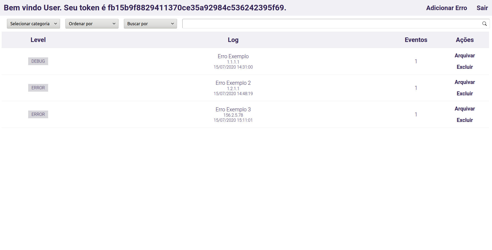
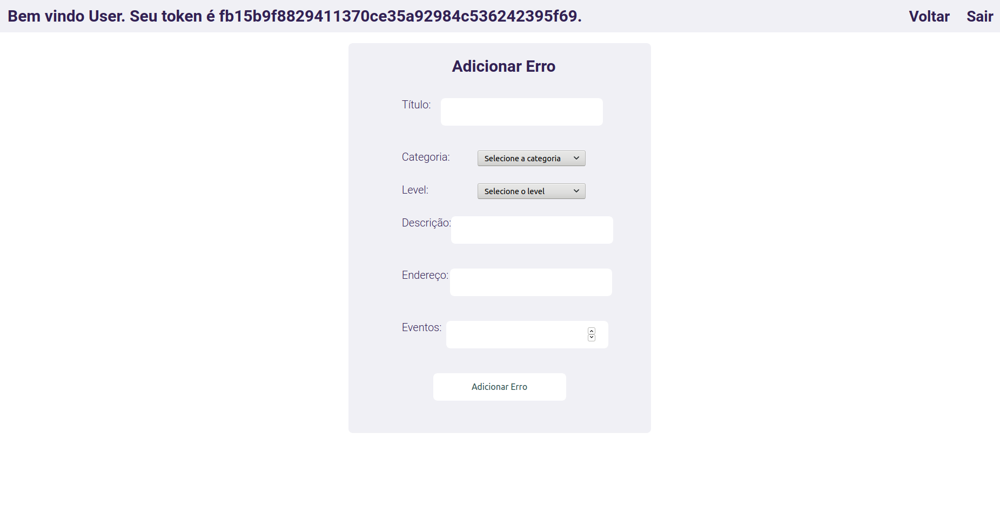

# Central de Erros

Projeto prático final da aceleração Python Online da CodeNation.

## Sobre o Projeto
Em projetos modernos é cada vez mais comum o uso de arquiteturas baseadas em serviços ou microsserviços. Nestes ambientes complexos, erros podem surgir em diferentes camadas da aplicação (backend, frontend, mobile, desktop) e mesmo em serviços distintos. Desta forma, é muito importante que os desenvolvedores possam centralizar todos os registros de erros em um local, de onde podem monitorar e tomar decisões mais acertadas. Neste projeto vamos implementar um sistema para centralizar registros de erros de aplicações.

## Backend - API
- criar endpoints para serem usados pelo frontend da aplicação
- criar um endpoint que será usado para gravar os logs de erro em um banco de dados relacional
- a API deve ser segura, permitindo acesso apenas com um token de autenticação válido

## API Endpoints

### Autenticação
| Método | Endpoint | Descrição |
| -------- | -------- | -------- |
| POST | api/auth/register | Registra um novo usuário |
| POST | api/auth/login | Realiza o login e retorna o token de autenticação |

### Central de Erros
| Método | Endpoint | Descrição |
| -------- | -------- | -------- |
| POST | api/error/create | Cria um novo erro |
| GET | api/error/list?orderBy={order}&category={categoria}&searchBy={search_field}&search={search_args} | Retorna os erros desejados |
| GET | api/error/{error_id} | Retorna os detalhes do erro pelo id |
| DELETE | api/error/{error_id} | Deleta o erro pelo id |
| POST | api/error/{error_id} | Arquiva o erro pelo id |

## WEB

* ## [Login](https://vs-errorcentral.herokuapp.com/login)

* ## [Cadastro](https://vs-errorcentral.herokuapp.com/cadastro)

* ## [Listagem dos erros](https://vs-errorcentral.herokuapp.com)

* ## [Detalhar erro](https://vs-errorcentral.herokuapp.com/error/1)

* ## [Adicionar erro](https://vs-errorcentral.herokuapp.com/adderror)

